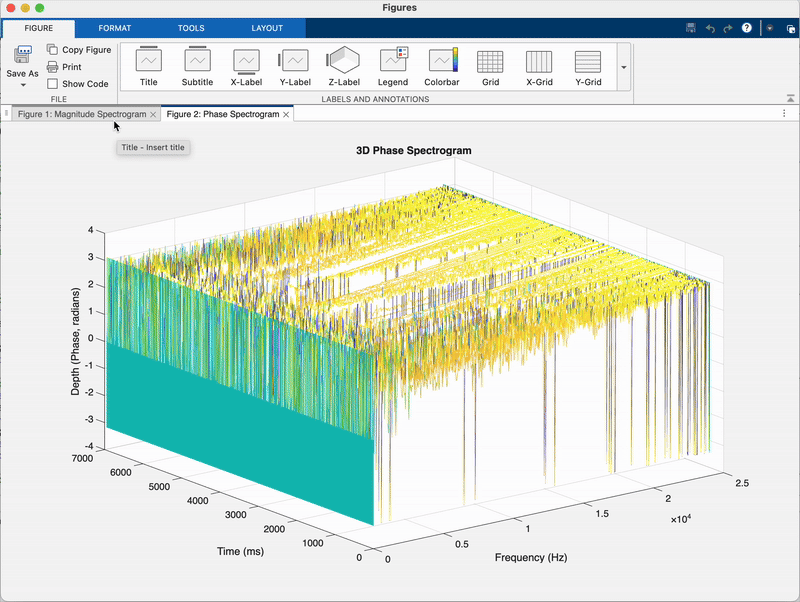

# MySpectrogram_MATLAB — Custom STFT Spectrogram Tool
[](LICENSE)
[](https://www.mathworks.com/products/matlab.html)
[](#)

[](#)

-6a1b9a.svg)


MySpectrogram_MATLAB is a MATLAB project that builds a spectrogram from scratch using frame-based FFT analysis.  
It computes magnitude and phase spectra on overlapping frames, keeps only the positive-frequency bins, and visualizes both in 3D using `mesh` and `waterfall`.

---

## Features

- Frame-based STFT analysis with user-defined frame length **N** and hop size
- Separate 3D plots for:
  - **Magnitude spectrogram** (frequency × time × magnitude)
  - **Phase spectrogram** (frequency × time × phase in radians)
- Positive-frequency storage only (`0 .. N/2`), mirroring typical audio spectrogram layouts
- Returns both magnitude and phase matrices for downstream DSP or reconstruction work
- Clean function interface: you can reuse `mySpectrogram` in other scripts and projects

---

## Repository Contents

| File                         | Description                                              |
|-----------------------------|----------------------------------------------------------|
| `MySpectrogram_MATLAB.m`    | Main demo script that calls `mySpectrogram` and plots 3D magnitude & phase |
| `mySpectrogram.m`           | Custom spectrogram function (magnitude & phase, positive frequencies only) |
| `spectrogram_animation.gif` | (Optional) Short GIF showing the 3D spectrogram updating in real time |

---

## Animated Spectrogram Demo

<p align="center">
  
</p>

_This animation shows the magnitude and phase spectrograms evolving across time and frequency — a visual look into frame-based Short-Term Fourier Transform (STFT) behavior._


---

## How to Use

1. Place a mono `.wav` file (for example `MyQoutes_Mono.wav`) in the same folder.
2. Open `MySpectrogram_MATLAB.m` in MATLAB.
3. Adjust these parameters if needed:

   ```matlab
   fileName = "MyQoutes_Mono.wav";
   N        = 1024;   % frame length in samples
   hop      = 512;    % hop size in samples
   ```
4. Run the script.
5. Inspect the two figures that appear:

   - **Magnitude Spectrogram (3D mesh)** — shows how frequency magnitudes evolve across time.
   - **Phase Spectrogram (3D waterfall)** — shows phase values in radians across time.

---

## `mySpectrogram` Function Signature

```matlab
[magFrames, phaseFrames, numFrames] = mySpectrogram(x, N, hop);
```

---

## Arguments

| Name                        |                                          Meaning                          |
|-----------------------------|---------------------------------------------------------------------------|
|`x`                          |                 Input mono signal (column vector)                         |
|`N`                          |                      Frame length in samples                                   |
|`hop`                        |                   Hop size between frames in samples                        |

---

## Returns

| Name                        |                         Meaning                                             |
|-----------------------------|-----------------------------------------------------------------------------|
|`magFrames`                  |                   Input mono signal (column vector)                         |
|`phaseFrames`                |                   Frame length in samples                                   |
|`numFrames`                  |                   Hop size between frames in samples                        |

---

## Technical Notes

- Frames are extracted with hop size hop; leftover partial frames at the end are ignored.
- Each frame is transformed using fft(frame, N).
- Only positive frequencies are kept:
  -  **Frequency bins** - 0 .. N/2 (MATLAB rows 1 .. N/2+1)
  -  Reduces data size and matches typical spectrogram format
- Magnitude and phase are stored as:
  ```
  magFrames(:, m)   = abs(Xpos);
  phaseFrames(:, m) = angle(Xpos);
  ```

  ---

## Engineering Relevance

This project demonstrates real audio-DSP procedures used in industry:
  -	Short-Time Fourier Transform (STFT)
	-	Frame windowing and hop-size logic
	-	Magnitude vs. phase interpretation
	-	Efficient storage of positive-frequency bins
	-	3D debugging visualization for spectral algorithms
The mySpectrogram function can be reused for:
  - Plugin prototyping
	- Audio feature extraction for ML
	- Game audio + post-production analysis
	- Real-time DSP research and coursework

---

## Requirements

- MATLAB R2023b or later
- Audio Toolbox recommended
- Tested using:
  - N = 1024
  - hop = 512
  - Mono .wav input (44.1 kHz)

---

## Real-World Applications

The `mySpectrogram` function is directly applicable to professional audio, DSP research, and machine-learning workflows where time–frequency analysis is required. Example use cases include:

- **Speech recognition & voice activity analysis**  
  Detecting phoneme boundaries, plosive bursts, fricatives, and prosodic patterns.

- **Music information retrieval (MIR)**  
  Tracking pitch content, instrument onsets, transients, and harmonic evolution over time.

- **Sound design & sample curation**  
  Visual identification of noisy vs. tonal vs. percussive material to improve editing workflows.

- **Audio for games & interactive media**  
  Dynamically classifying input signals for adaptive DSP (e.g., filter switching, effect routing).

- **Machine learning on audio**  
  Converting audio into spectrogram feature vectors for neural networks (CNNs, transformers, diffusion models).

- **Broadcast & post-production QC**  
  Fast identification of hums, broadband noise, mouth clicks, and sudden level changes.

- **Acoustic research & instrument analysis**  
  Studying formants, partial structures, room response, and damping characteristics.

The goal of the project is to provide an interpretable DSP visualization tool that exposes magnitude and phase behavior across time, making it useful for both engineering and creative audio workflows.

---
© Henry Powell — Audio DSP Development


                                 

